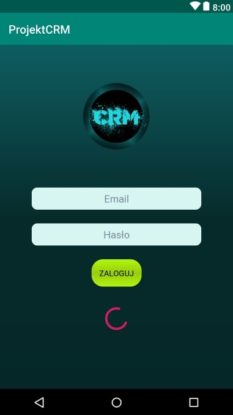
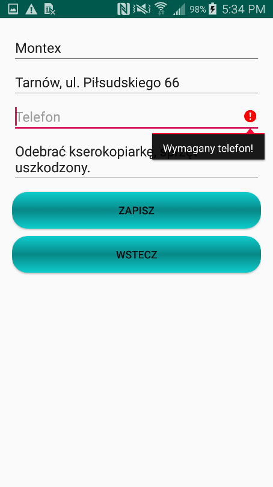
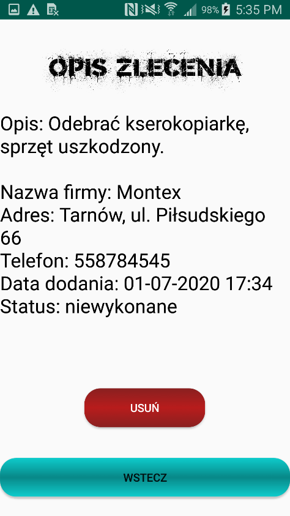
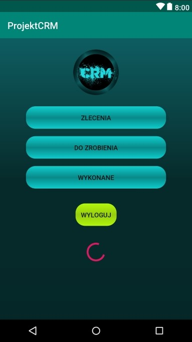
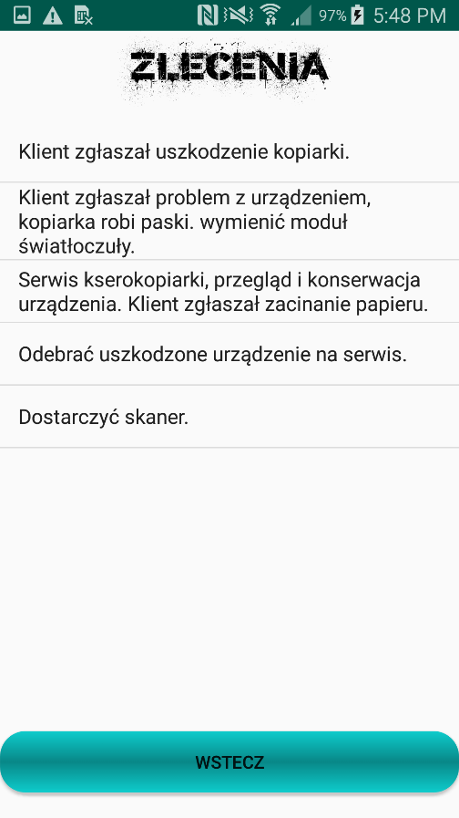
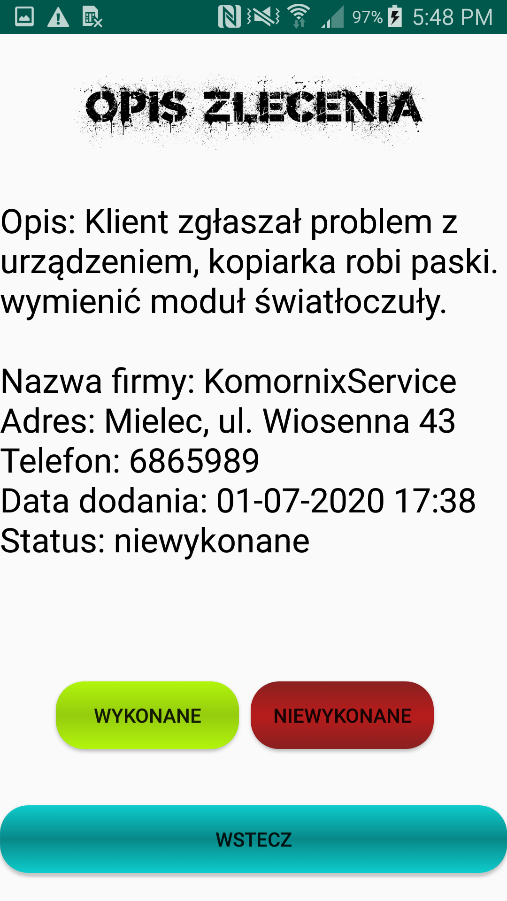

# Mobile CRM
> Simple CRM for Android.

## Table of contents
* [General info](#general-info)
* [Screenshots](#screenshots)
* [Technologies](#technologies)
* [Setup](#setup)
* [Features](#features)
* [Status](#status)
* [Inspiration](#inspiration)
* [Contact](#contact)

## General info
It's very simple CRM which allow to manage tasks ordered for employee.
* After loggin on boss account can add tasks which employee have to do
* Logged employee have access to all tasks and can change status of them for done/ undone
* Employee can view list of all task or only done/ undone
* Boss can track employee progress and edit tasks
* Boss can create new users by registration form

## Screenshots

 
Loggin page  

 
Boss menu  

 
Add new task, data validation- phone required  

 
Registration new employee  

 
Task details visible for boss  

 
Employee menu  

 
Task list  

 
Task details for employee, tap to change status 

## Technologies
* Tech 1 - JAVA
* Tech 2 - Android Studio
* Tech 3 - Google Firebase

## Setup
* Configure Google Firebase
* Google Play service required

## Code Examples

## Features
* Easy to use
* Boss can track employee progress

## Status
Project finished.

## Inspiration
Internet

## Contact
Created by PHPHitman.
